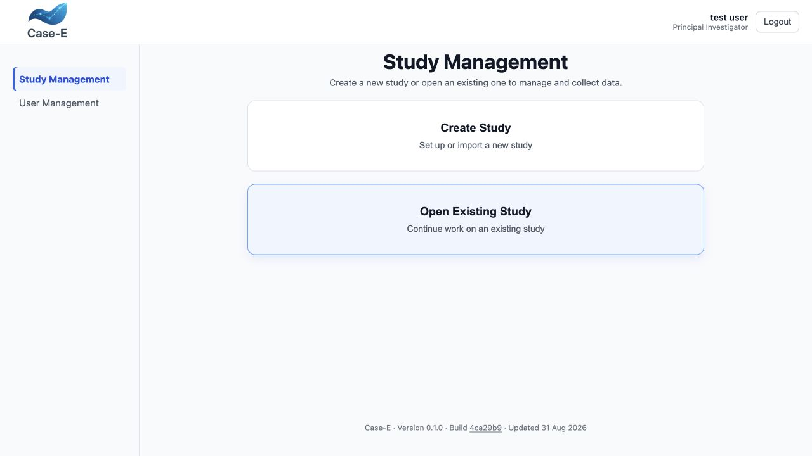
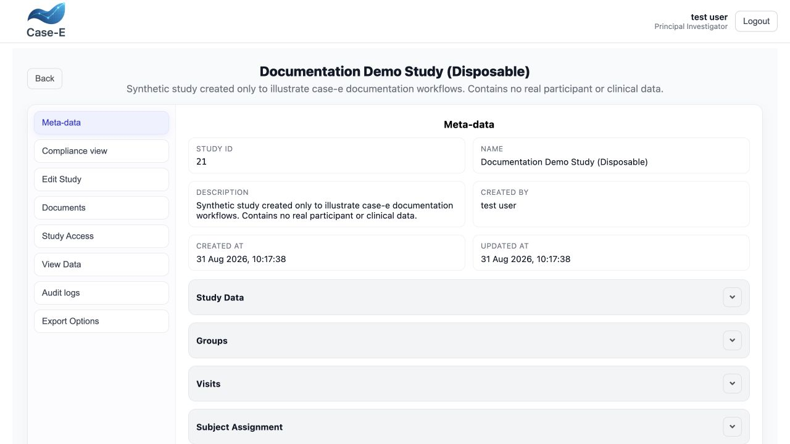
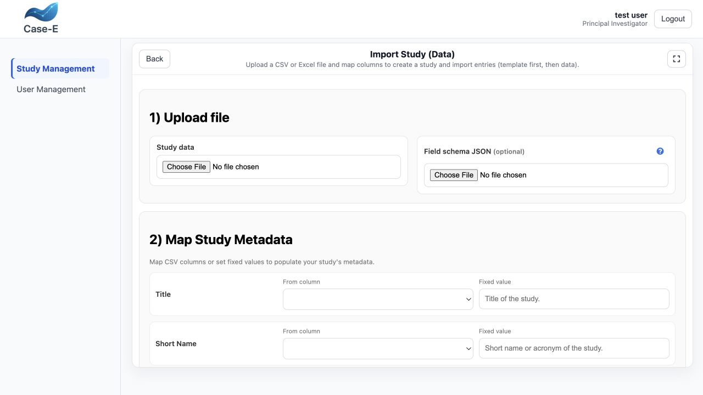

Application screen reference
============================

This chapter maps the visible case-e screens to their available operations. It
is the quickest way to find where a function lives.

Login and account
-----------------

**Login** authenticates an existing account and provides show/hide password,
**Forgot password?**, account registration, documentation, source, partner, and
contact links. **Register** creates an account where registration is enabled;
an administrator still controls the effective role and study access. The public
**Contact** page provides the project contact and supporting links.

Password recovery first looks up the username, shows only a masked email hint,
and asks for confirmation before sending a one-time link. The link opens
**Choose a new password** and is valid only while the configured reset service
is enabled and the token has not expired or been used. See
:ref:`password-recovery-admin` for account and server details.

The dashboard account area shows the signed-in name and role and provides
logout. **User information** contains profile, password, and, for
Administrators, user-management workflows. Login and dashboard footers identify
the application version, build, and build date; a hosted build can link its
build ID to the corresponding GitHub commit.

Study Management dashboard
--------------------------

Create Study
   Available to Administrators and Principal Investigators. Opens the study
   creation wizard.

Open Existing Study
   Lists accessible studies with name/description search, result count, status,
   timestamps, **Add Data**, and **View Study** actions according to permission.

   Study Management after signing in as a Principal Investigator. The two
   primary paths are creating a study and opening an accessible existing study.

Draft studies display a **DRAFT** marker. Attempting Add Data is blocked until
setup is published. Opening a draft offers continue/edit, view when permitted,
or the controlled discard flow.

Create/Edit Study wizard
------------------------

Step 1 — Study details
   Enter the schema-driven study metadata. A template-only JSON exported from
   another installation can be imported here. During new-study creation, this
   step also provides **Import Study (Data)** for participant data from CSV or
   Excel. Creating or editing supports save-draft-and-leave and unsaved-change
   prompts.

Step 2 — Groups
   Set the group count and complete every required group metadata panel.

Step 3 — Subject setup
   Set subject count, assignment method, and ID format. Creation can be skipped
   when appropriate. Presets and custom patterns use ``{PREFIX}``, ``{NUMBER}``,
   ``{UUID}``, ``{UUID8}``, and ``{RAND6}``; number start/padding and previews
   are available. The format locks after publication.

Step 4 — Group assignment
   Assign subjects according to the selected method and validate that required
   assignments are complete.

Step 5 — Visits
   Set visit count and complete schema-driven visit metadata. Panels expose
   missing-required-field counts.

Step 6 — Forms
   Opens the form builder, reusable templates, advanced logic, and Schedule of
   Assessments.

Form builder
------------

Available Fields has four active sources:

Standard Template
   Search specialized clinical sections, preview matching fields, and add
   selected properties.

Custom Fields
   Add a supported blank field type to the active section.

Ontology (OBI)
   Search after two characters, inspect OBI identifier, definition, and
   synonyms, select several results, and load more results.

Saved Templates
   Search/refresh complete-form and selected-section templates, insert a saved
   section, and delete templates when authorized.

The builder toolbar provides **Add Section**, **Rearrange**, **Logic &
Calculations**, **Value Assignments**, **Save Draft and Leave**, and **Create
Visit Schedule**. The additional-options menu provides:

* Import CSV / Excel Template;
* Download Template;
* Upload Template;
* Save template/form; and
* Clear All.

Sections can be renamed, inserted below another section, deleted, expanded, and
collapsed. Fields can be edited, copied using basic/complete modes, deleted, and
rearranged with sections. See :doc:`field-settings` and :doc:`form-logic` for
the complete field dialogs.

Save template/form
------------------

Choose the complete form or selected sections, supply a required title and
description, and save. Selected-section mode provides select/deselect all and
shows the number of fields in each section. The corresponding delete workflow
can remove a complete saved form or selected saved sections and cannot be
undone.

Schedule of Assessments
-----------------------

The schedule/protocol matrix assigns every form section across visit and group
columns. Row and column controls support bulk toggling. **Preview** walks through
visit/group combinations. Publishing validates logical dependencies and matrix
coverage, warns about empty visits, can navigate to the first empty visit, and
requires confirmation for important unresolved conditions.

Add Data
--------

The data-entry screen selects a subject and visit from the completion matrix,
loads the assigned sections, enforces access, and evaluates visibility,
reminders, value assignments, and calculations. It provides:

* whole-entry **Save Data** and **Clear**;
* live completed/total/percentage progress and a filterable **Review remaining**
  navigator;
* confirmation that visible unchecked checkboxes should be recorded as No;
* skip-required reason/confirmation workflow;
* add/edit/copy/delete for repeating table rows;
* upload or URL files, deferred deletion on save, and an uploaded-files browser;
* import values or selected table rows from a previous visit;
* spreadsheet data import;
* single and bulk shared-link creation/management;
* edit-lock status and optimistic revision conflict resolution; and
* unsaved-change protection.

Spreadsheet data import
-----------------------

Choose **One selected subject** or **All subjects**. Select the target context,
upload CSV/XLSX/XLS, select a sheet, and choose automatic, one-row, or two-row
section/field headers. Map optional subject/visit/group metadata columns, then
map data columns manually or with **Auto match**. Filter unmatched columns and
clear mappings as needed. Preview status distinguishes ready, warning, and error
rows; only valid rows are committed.

Shared links
------------

Create mode shows the current subject/group/visit, permission, maximum uses,
expiry in days, and allowed sections. Bulk mode is limited to subjects in the
same group and allows per-visit section selection. Generated links can be
exported to CSV.

Manage mode lists links, sections, use counts, expiry/access status, and supports
revocation and CSV export. See :doc:`collaboration` for the operating procedure.

View Study
----------

   **View Study** brings metadata, compliance, editing, documents, access,
   collected data, audit logs, and exports into one permission-aware workspace.

Meta-data
   Collapsible Study Data, Groups, Visits, Subject Assignment, per-subject
   assignment, and Template Versions.

Compliance view
   Shows current-scope recruitment, retention, data completeness, visit/group
   comparisons, threshold and distribution charts, and skipped-required counts.
   Its scope begins with subjects and visits that have started. See
   :doc:`oversight` for the exact calculation.

Edit Study
   Launches each wizard step separately. Authorized users can also permanently
   delete the study from the database and study filesystem.

Documents
   Lists study-level attachments and their relative storage paths. Authorized
   users can download files; managers can upload several pending documents with
   a separate optional description for each, edit/add descriptions, or delete
   documents with confirmation.

Study Access
   Lists grants, revokes access, selects an existing user, and grants View, Add
   data, and Edit study permissions. **Study Configurations** is currently a
   placeholder and is identified in :doc:`limitations`.

View Data
   Embeds the version-aware data dashboard with fullscreen/sidebar controls,
   sorting, filters, pagination, file browsing, and export.

Audit logs
   Switches between study and subject audit views, filters a subject, refreshes,
   exposes raw event details, and opens structured diffs.

Export Options
   Exports a full or selected JSON template. An owner or Administrator can open
   **Download Study** for a standard BIDS ZIP or a custom version/scope/content
   package, or **Download Study For Merge** for a template-and-CSV transfer
   bundle. Local installations can open the BIDS dataset location when the
   operating system supports it. See :doc:`review-export`.

View Data dashboard
-------------------

The dashboard fixes Subject, Group, and Visit columns and groups the remaining
columns by form section. Table fields expand into row/column columns for the
visible repeating rows. Controls include version selection, column filters,
sorting, 50/100-page sizes, **View all** up to 1,000 rows, first/previous/next/
last navigation, uploaded-file listing, and file download.

Audit and diffs
---------------

The study audit view records design and access events. The subject audit view
records data activity by subject/visit/group. **Show diff** displays structured
before/after changes when available; raw detail expansion exposes the underlying
event metadata for authorized review.

Import and merge existing data
------------------------------

The new-study **Import Study (Data)** action is located in step 1 of **Create
Study**, beside **Import Study Template**. It accepts CSV/XLSX/XLS and maps
study, subject, group, visit, and CRF data to create structure before importing
entries.

   The initial import screen accepts the study-data file and an optional field
   schema, then maps source columns or fixed values to study metadata.

The existing-study **Import Data** workflow accepts a case-e transfer bundle or
a subject-focused spreadsheet import. Bundle import displays an import summary
and template comparison, then permits all-subject or selected-subject scope.
When incoming and existing values conflict, reviewers can choose incoming or
existing per item, filter by subject, or apply one decision to all.

Subject-focused import selects the target subject, visit, and group; uploads the
source; selects a source row; previews the fields to import; and saves only after
review.

Documentation, application, and contact links
---------------------------------------------

The documentation home page provides permanent links to:

* **Use hosted case-e** — :doc:`hosted-access`, which explains account creation,
  the initial Investigator role, collaboration contact, and study-design access;
* **Run case-e locally** — :doc:`getting-started`;
* **Host case-e on a server** — :doc:`deployment`;
* **Complete feature index** — :doc:`feature-index`;
* **Contact & collaboration** — :doc:`support`; and
* **Application source** — the GitHub source repository.

The hosted guide links to ``https://ecrf.inm7.de/login`` only after explaining
registration and permissions. For collaboration, institutional use, or
hosted-access questions, contact Prof. Jürgen Dukart using the details in
:doc:`hosted-access` or :doc:`support`.
