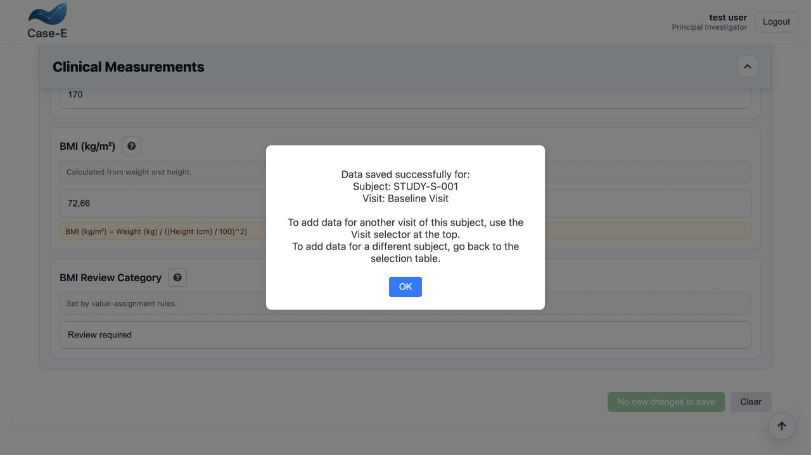
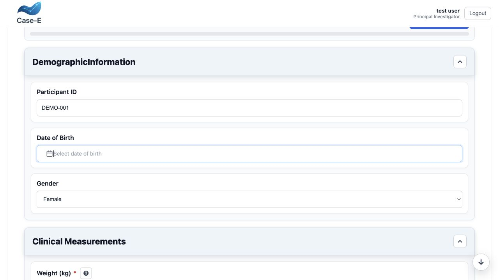
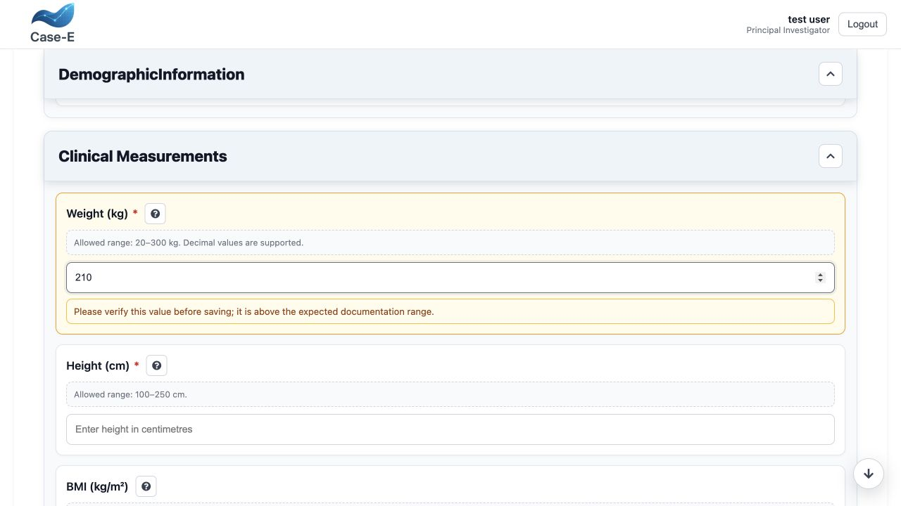
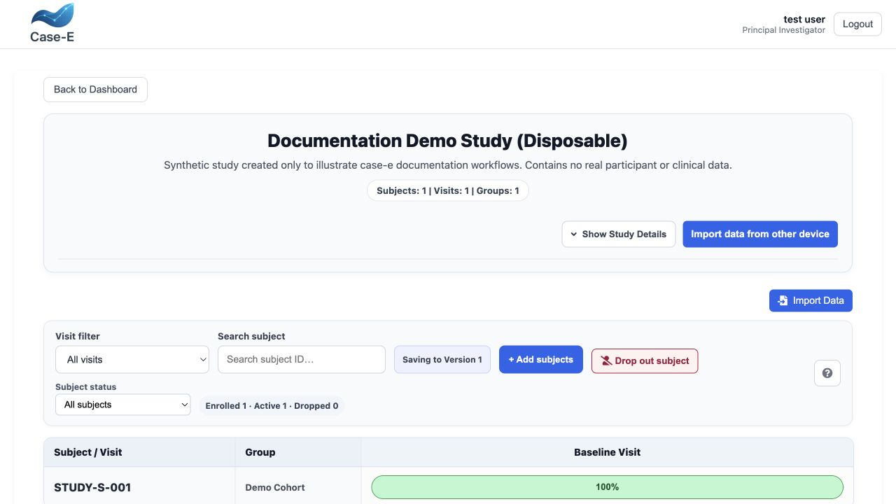

Subjects, visits, and data collection
=====================================

Routine data collection starts from the subject-by-visit matrix. Each available
cell represents a form slot for one subject and one visit, subject to the
protocol matrix, group assignment, and the user's permissions.

Open a data-entry form
----------------------

#. Open a published study.
#. Go to **Data entry**.
#. Search for or select a subject.
#. Select the required visit and form slot.
#. Confirm the subject, visit, group, and form shown in the header.
#. Enter data and resolve validation messages.
#. Select **Save Data**.

   A fully synthetic entry after saving. case-e calculated BMI from weight and
   height, applied the review-category assignment, retained the outlier reminder,
   and reported 100% visible-data completion.

The save action writes the whole available entry. It is not an independent save
for only the currently visible section. If you leave with unsaved changes, the
application warns before navigation; do not rely on that warning as a substitute
for saving.

Progress and remaining-field navigator
--------------------------------------

The entry header shows **Data entered**, the completed and total visible data
points, a percentage bar, and the number explicitly skipped. Conditional fields
are counted only while visible. A table or another compound control can
contribute more than one data point.

When work remains, select **Review _n_ remaining**. The navigator lists the
field and section, indicates **Required**, **Optional**, or **Needs correction**,
and shows the remaining point count for compound fields. Filter the list, select
an item to reveal its section and scroll to it, then use the down-arrow control
to advance to the next remaining field. The navigator uses the live form state,
so a field newly shown by conditional logic appears without requiring a save.

Validation and missing data
---------------------------

Required fields and configured constraints are checked before a normal save.
Where the workflow permits it, a required value can be explicitly skipped. A
skipped required field is different from a value that has never been reviewed
and is highlighted accordingly in data views.

Use the skip mechanism only under the protocol's missing-data rules. If a reason
must be recorded, provide it in the designated field or operational workflow.

   Inline validation explains the configured date format and disables a normal
   save until the value is corrected.

   A configured reminder is displayed directly below its source field when the
   synthetic value matches the rule. Reminders inform the user but do not block
   saving unless a separate constraint fails.

Confirm unchecked checkbox answers
----------------------------------

An unchecked checkbox can mean either “No” or “not reviewed.” Before a save,
case-e lists every visible, editable checkbox that is still unchecked in the
**Confirm unchecked answers** dialog, grouped by section.

* Select **Go to question** to return to an item that should be changed.
* To keep the answers unchecked, select the acknowledgement and then **Confirm
  and Save**.
* Confirmed values are recorded as ``false`` (No), count as answered in entry
  progress, and add the number of confirmed checkboxes to the save audit label.
* **Cancel** returns to the form without saving.

Hidden and read-only checkboxes are not offered for confirmation. The same
confirmation applies when data is saved through an add-data shared link.

Repeating tables
----------------

For table fields, add one row for each repeating event or item. Validate every
column before saving. Row operations are part of the same form entry, so save the
entry after adding, copying, editing, or deleting rows.

Files
-----

For an upload field, select a permitted file and wait for the interface to show
that it is attached before saving. For URL mode, enter the approved location.
Multiple-file fields may accept several objects. Never upload directly
identifying material unless the protocol, permissions, and hosting environment
explicitly allow it.

Removing an already saved upload queues the deletion; case-e first saves the
new form value and then deletes the queued file record. This avoids deleting the
attachment merely because a user changed the form and then left without saving.
If the form save succeeds but file deletion fails, case-e reports that the data
was saved and keeps the deletion queued. Select **Save Data** again to retry.
Verify the file browser after a partial failure.

Import from a previous visit
----------------------------

When the same information is collected repeatedly, **Import previous visit** can
copy supported values into the current entry, including supported table rows.
Always review the imported values before saving; the previous answer may no
longer be true.

Clear an entry
--------------

**Clear** removes entered values from the current form. Confirm the subject,
visit, and form before using it. If records must be retained for audit or
regulatory reasons, follow the approved correction workflow rather than clearing
data simply to hide an error.

Bulk import
-----------

case-e supports tabular import from CSV, XLSX, and XLS files.

#. Start the import from the relevant study.
#. Upload the source file.
#. Map source columns to study fields.
#. Review the preview status for every row:

   * **Ready** — the row passed the current checks;
   * **Warning** — the row can require attention but may still be usable;
   * **Error** — the row cannot be committed as shown.

#. Correct mapping or source problems.
#. Commit only the validated rows.
#. Reconcile imported record counts and inspect a sample in the normal data
   view.

An import preview does not prove semantic correctness. Verify units, date
formats, choice coding, subject identifiers, group/visit mapping, and decimal
conventions before committing.

Concurrent editing
------------------

Entries use revision information to detect edits based on an older version. If
another user saved first, case-e can present field or table conflicts for review.
Choose values deliberately rather than overwriting the newer record. Editing
locks reduce collisions but do not replace communication between data-entry
staff.

Completion workflow
-------------------

Use the matrix indicators to identify expected, incomplete, or completed slots.
Before marking a visit operationally complete:

   The subject-by-visit matrix shows the saved Baseline Visit at 100% and keeps
   visit, search, subject-status, import, and enrollment controls in context.

* confirm every expected form is available;
* resolve validation errors and unexplained skipped fields;
* check repeating rows and uploads;
* save all modified entries; and
* review the corresponding row in **View data**.

Subject dropout and read-only records
-------------------------------------

Dropped subjects whose data is retained remain visible for review but cannot
receive new entries, edits, imports, or uploads. Deleted-data dropouts remain in
the enrollment/status summary without active participant data. Only a study
owner or Administrator can perform the controlled action. See
:doc:`oversight` for modes, safeguards, audit behavior, and compliance impact.
