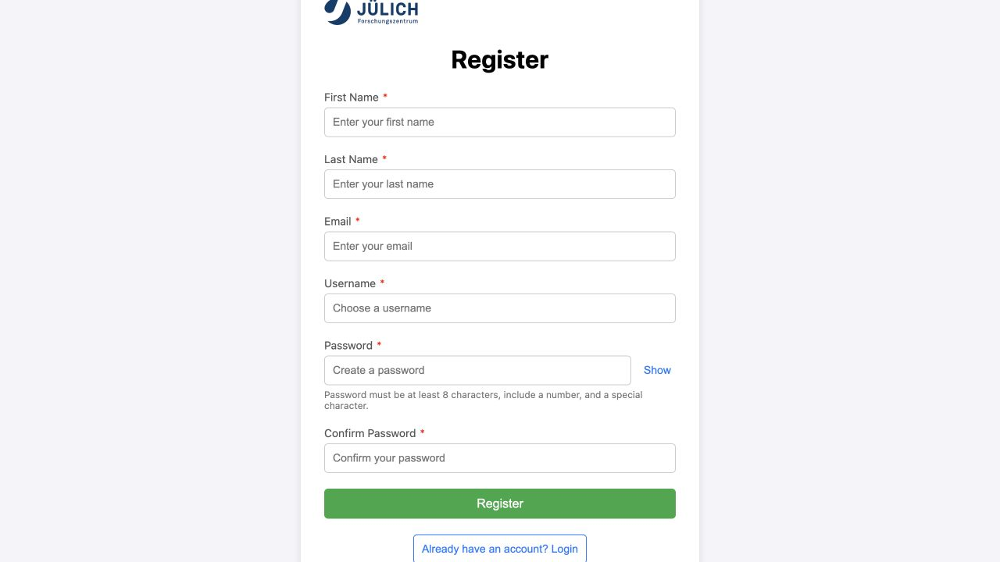

Use the hosted case-e service
=============================

The hosted case-e service provides an existing managed installation at
`https://ecrf.inm7.de/login <https://ecrf.inm7.de/login>`_. Start here when you
want to join the service, collaborate on a study, or design a study without
installing case-e locally.

1. Create your user account
---------------------------

#. Open the `hosted case-e login page <https://ecrf.inm7.de/login>`_.
#. Select **Create account**.
#. Enter your first name, last name, email address, username, password, and
   password confirmation.
#. Use at least eight password characters, including a number and a special
   character.
#. After registration succeeds, return to the login page and sign in.

   The account-registration form. The screenshot comes from the current local
   reference build; the hosted service uses the same required account fields.

.. raw:: html

   

     <a href="https://ecrf.inm7.de/login">Open hosted case-e</a>
   

2. Understand your initial access
---------------------------------

A self-registered account is created with the platform role **Investigator**.
This is the initial/minimum working role, but it does not automatically grant
access to an existing study and does not permit the account to create a new
study by itself.

Study access is granted separately. Depending on the collaboration, a study
owner or Administrator can grant **View**, **Add data**, and/or **Edit study**.
Creating and owning a new study requires Principal Investigator or
Administrator access.

3. Contact Prof. Jürgen Dukart
------------------------------

After creating the account, contact **Prof. Jürgen Dukart** to discuss the
collaboration, hosted access, and the intended study:

* Email: `j.dukart@fz-juelich.de <mailto:j.dukart@fz-juelich.de?subject=case-e%20hosted%20collaboration>`_
* Group: `Biomarker Development at INM-7
  <https://www.fz-juelich.de/en/inm/inm-7/research-groups/biomarker-development>`_

Include your case-e username, institution, study purpose, approximate numbers
of users and subjects, expected data types, desired timeline, and whether you
want to create a new study or join an existing one. Do not send passwords,
participant information, clinical files, password-reset tokens, or active
shared links by email.

Prof. Jürgen Dukart and the service team can then determine the appropriate
collaboration arrangement and coordinate the required platform role and
study-level access.

4. Start designing the study
----------------------------

After access has been approved, use the path that matches the collaboration:

New study
   With Principal Investigator or Administrator access, open **Study
   Management → Create Study**. Define study details, groups, subjects,
   assignments, visits, forms, and the Schedule of Assessments. Follow
   :doc:`studies`, :doc:`form-design`, :doc:`field-settings`, and
   :doc:`form-logic` before publishing.

Existing collaborative study
   Ask the study owner to grant the required permissions. **Edit study** is
   needed for design work; **Add data** permits data entry; **View** provides
   read-only study access. Open **Study Management → Open Existing Study** after
   the grant is saved.

Do not enter real participant data until the study design, access model,
hosting controls, protocol assignments, validation behavior, backup process,
and required organizational approvals have been reviewed.

Hosted onboarding checklist
---------------------------

* Create the hosted user account and record the username securely.
* Confirm that the account shows the Investigator role after login.
* Contact Prof. Jürgen Dukart with the collaboration summary.
* Agree whether the user will join an existing study or create a new study.
* Confirm the platform role and study permissions required for that work.
* Test access with non-production data before starting the study.
* Complete the study design and publishing checks in :doc:`studies`.

For support channels, documentation ownership, and the AI-generation legal
notice, see :doc:`support`.
