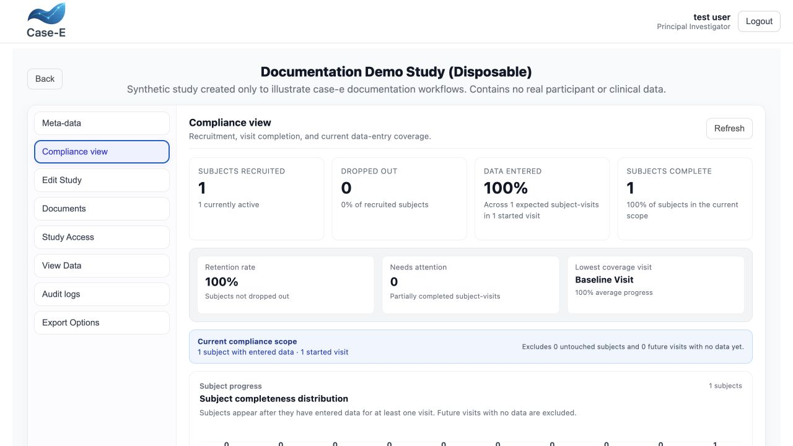

Study oversight, compliance, and dropout
========================================

case-e provides an operational **Compliance view** and a controlled subject
dropout workflow. These functions use the data already saved in the study; they
do not replace protocol-defined monitoring, source verification, or statistical
analysis.

Open Compliance view
--------------------

#. Open **Study Management** and **Open Existing Study**.
#. Select **View Study** for the published study.
#. Open the **Compliance view** tab.
#. Select **Refresh** whenever recently saved entries or dropout changes are not
   yet represented.

Any user who can view the study can open the compliance summary. The generated
time at the bottom identifies when the displayed calculation was refreshed.

Compliance dashboard
--------------------

The top-level indicators show:

Subjects recruited
   Every subject ever enrolled, with the number currently active.

Dropped out
   The total dropped-subject count and its percentage of recruited subjects.

Data entered
   Average completion across the subject-by-visit scope that has started. The
   card also reports the number of expected subject-visits and started visits in
   that scope.

Subjects complete
   Subjects at 100% completion and their percentage of the currently evaluable
   subjects.

Operational indicators identify the retention rate, partially complete
subject-visits that need attention, and the visit with the lowest average data
coverage.

   The compliance view summarizes recruitment, dropout, entered-data coverage,
   complete subjects, retention, and operational attention indicators. This
   screenshot contains only the disposable synthetic study.

The remaining visualizations provide:

* a histogram of subjects by completeness range;
* an overall-compliance radial indicator;
* recruitment status split into active, dropped with data retained, and dropped
  with data deleted;
* a completeness threshold curve, including 80%, 90%, and 95% reference points;
* average progress for each started visit;
* complete, partial, and not-started subject-visit counts;
* the number of skipped required fields;
* group-by-group compliance comparison; and
* a visit-detail table with expected, complete, partial, not-started, and data
  entered values.

How compliance is calculated
----------------------------

The calculation deliberately excludes subjects and visits that have not yet
entered the active collection scope:

#. A subject becomes evaluable after data is entered, or a required field is
   explicitly skipped, in at least one assigned visit.
#. A visit becomes started after at least one evaluable subject starts it.
#. Subjects with no started visits and future visits with no data are excluded.
#. Within the remaining subject × visit scope, each expected subject-visit has
   equal weight: complete contributes 100%, partial contributes its saved
   progress percentage, and an expected but not-started visit contributes 0%.
#. A retained dropout remains included once that subject has started data entry.
   A dropout whose active data was deleted is excluded.

This scope prevents untouched subjects and future visits from reducing the
current operational percentage while preserving genuine gaps inside started
work. Always record the calculation scope when reporting a number outside
case-e; it is not the same as dividing completed fields by every theoretically
possible field across the complete future study.

Drop out a subject
------------------

Only the study owner or an Administrator can perform a dropout. Shared links
cannot initiate the workflow.

#. Open the study's **Add Data** subject/visit matrix.
#. Select **Drop out subject**.
#. Choose one of the two modes described below.
#. Select an active subject and confirm the displayed record/file counts.
#. Enter the dropout date and choose a reason.
#. If the reason is **Other**, enter the required free-text explanation.
#. Review the warning and confirm the action.

Supported reasons are withdrawal of consent, lost to follow-up, adverse event,
investigator decision, protocol deviation, non-compliance, disease progression,
death, administrative reason, and other.

Drop out and keep existing data
~~~~~~~~~~~~~~~~~~~~~~~~~~~~~~~

Existing entries and file references remain available for authorized review
and export, but the subject becomes read-only. case-e blocks new data entry,
editing, imports, and uploads for that subject. The matrix can display retained
dropouts through the **Subject status** filter.

Drop out and delete subject data
~~~~~~~~~~~~~~~~~~~~~~~~~~~~~~~~

This mode removes the subject's entries and file records from the active case-e
dataset and expires that subject's shared links. It requires both an explicit
acknowledgement and the exact subject ID typed into the confirmation field.

The action does **not** erase previous exports, backups, DataLad/git-annex
remotes, or files hosted outside case-e. The application describes active data
as non-restorable through case-e, so the responsible operator must separately
apply the organization's retention and erasure process to every external copy.

After dropout
-------------

The selection matrix offers filters for active subjects, active plus retained
dropouts, retained dropouts, deleted-data dropouts, and all subjects. It also
shows ever-enrolled, active, and dropped totals. Dropout badges expose the
recorded reason and date.

Each dropout records the actor, date, reason, previous/new status, and whether
data was retained or deleted in the audit history. Deleted-data events also
record removal counts. An existing entry cannot be moved to a different
subject, existing subject IDs/positions cannot be changed, and dropout status
cannot be edited through the ordinary study-update path.

Oversight checklist
-------------------

* Refresh the dashboard after imports, corrections, or dropout actions.
* Investigate partial subject-visits and skipped required fields, rather than
  relying only on the overall percentage.
* Check group and visit differences for operational causes.
* Reconcile retained/deleted dropout counts with the protocol log.
* Review the corresponding subject audit event after every dropout.
* Export and preserve evidence according to the approved monitoring and
  retention procedure.
