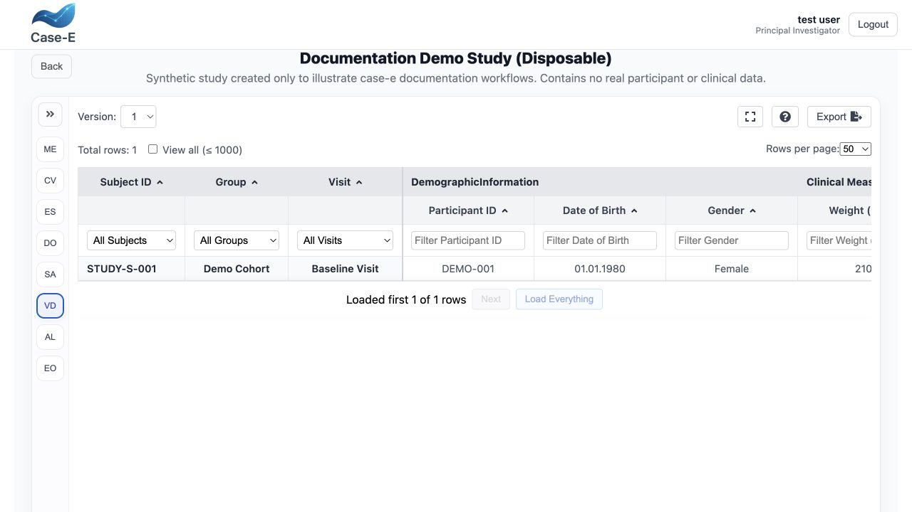
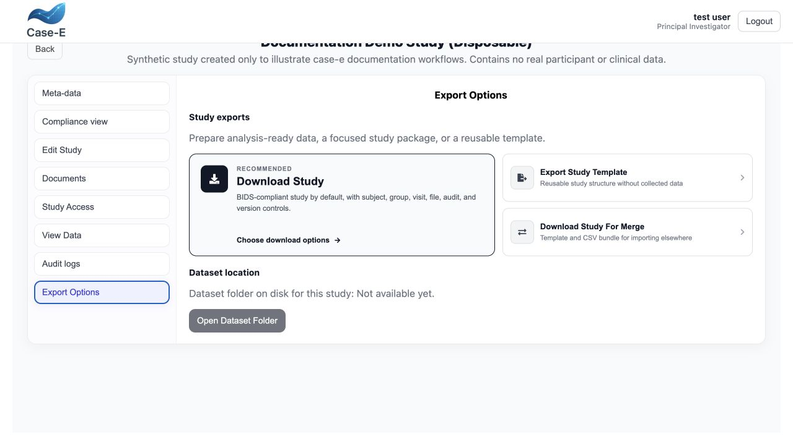
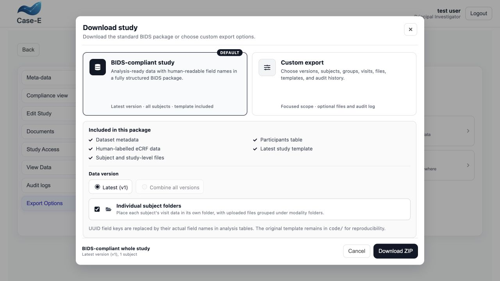

Review, audit, and export
=========================

Use **View data** to review collected records before analysis or handoff. Export
is a snapshot; it does not replace the live entry history or the study's backup.

View data
---------

The data table presents one row for a subject/visit record and groups columns by
form structure. Depending on the view, you can:

* select a saved version;
* sort and filter rows;
* choose 50 or 100 rows per page;
* use **View all** for datasets up to the supported 1,000-row limit;
* download permitted file attachments; and
* distinguish unavailable assignments and skipped required values.

Loading, filters, and pagination are applied without discarding the current
study/version context. Export from this table loads all records for the selected
version rather than only the rows currently visible on the page.

Cells shown in gray indicate that the form or field is not assigned in that
subject/visit context. Skipped required values are shown in red. Interpret these
states separately from an ordinary empty value.

   **View Data** groups columns by form section and provides version selection,
   subject/group/visit filters, per-field filters, sorting, pagination, and a
   direct extract action.

Versions and audit information
------------------------------

Version selection allows an earlier saved state to be inspected. Audit
information helps establish who changed data and when. The exact records
required for a regulated audit trail depend on deployment policy and validation;
confirm that the installed configuration meets the organization's requirements
before production use.

Export surfaces
---------------

case-e separates a quick analytical extract, a template definition, and a full
study package. Choose the surface that matches the purpose.

View Data extract
~~~~~~~~~~~~~~~~~

CSV
   A plain tabular extract of the selected template version, suitable for
   analysis tools and scripted pipelines.

Excel-compatible XLS
   The same data in spreadsheet-oriented, Excel-compatible output. It should not
   be assumed to be a native XLSX workbook.

Both downloads include the complete selected-version result set, not merely the
current 50/100-row page.

Template JSON
~~~~~~~~~~~~~

JSON template
   A machine-readable study definition. Export the whole definition or a
   selected subject/visit subset from **View Study → Export Options → Export
   Template**. In subset mode, assigned sections are calculated from the chosen
   subjects and visits. Owners/Administrators may retain real group names;
   other permitted users receive anonymized group names. Use this for controlled
   design transfer, not as the only participant-data backup.

Full study ZIP
~~~~~~~~~~~~~~

   The export landing page separates the analysis-ready study package, reusable
   template, and merge bundle so their different purposes remain explicit.

**Download Study** is restricted to the study owner and Administrators. It has
two modes.

BIDS-compliant study (default)
   Produces a structured ZIP for the complete study with dataset metadata,
   participants table, human-labelled eCRF data, the applicable study
   template(s), and subject/study-level uploaded files. UUID field keys are
   replaced by field names in the analysis tables, while the original template
   remains under ``code/`` for reproducibility. Individual subject folders are
   optional and group each subject's visit data and modality files.

Custom export
   Select latest, all combined, or a specific template version; scope the
   package to the whole study, selected subjects, selected groups, selected
   visits, files only, or audit only; then choose analysis data, study template,
   uploaded files, audit log, and individual subject folders. File content can
   be limited to subject files or study-level files.

The generated analysis data uses human-labelled phenotype TSV files. A focused
subject/group/visit selection is required before its download button becomes
available.

   The default BIDS download summarizes its included metadata, participants,
   human-labelled eCRF data, template, and files. Custom export exposes narrower
   version, subject, group, visit, file, template, and audit scopes.

Combined-version exports
------------------------

When **Combine all versions** is selected, case-e creates one row per
participant and visit in ``phenotype/ecrf.tsv``:

* unchanged fields appear once and use their latest available value;
* only added, removed, renamed, or structurally changed fields receive version
  columns such as ``notes__v001`` and ``notes__v002``;
* stable field identifiers prevent unchanged fields from drifting merely
  because their label position changed;
* a display-only reorder of the same choice options does not create duplicate
  version columns; and
* changed repeating tables are exported as version snapshots (for example,
  ``medication__row01__dose``); historical rows are not automatically matched
  across versions.

Review template diffs before interpreting versioned columns. “Latest available
value” is a column-coalescing rule and should not be mistaken for longitudinal
imputation.

Merge bundle and local dataset
~~~~~~~~~~~~~~~~~~~~~~~~~~~~~~

**Download Study For Merge** creates a template-and-CSV bundle for importing
into another case-e study. It is different from the analytical BIDS package.

On a supported local installation, **Open Dataset Location** opens the canonical
BIDS directory. A hosted browser cannot open an arbitrary server filesystem
path; download a package instead.

Export data
-----------

#. Open **View Study → View Data** for a CSV/XLS extract, or **Export Options**
   for template/full-study downloads.
#. Choose the version before choosing the scope.
#. Choose the required subjects, visits, groups, forms, sections, files, or
   audit content where the selected export supports it.
#. Review group-name anonymization when exporting a template.
#. Generate and download the export or ZIP.
#. Verify record counts, columns, coding, missing-value representation, dates,
   units, and attachments.
#. Store the file in an approved location and record the export date and purpose.

Anonymization
-------------

Group anonymization can reduce direct identification in an export, but it does
not automatically make a dataset anonymous. Free text, dates, rare diagnoses,
file metadata, URLs, images, and small groups can remain identifying. Perform a
formal disclosure-risk review for any external release.

Reproducible handoff
--------------------

For analysis, keep together:

* the exported data;
* the corresponding JSON study definition;
* export filters and anonymization settings;
* application version and export time;
* a checksum when required; and
* the analysis code or data dictionary that interprets field identifiers.

Backup versus export
--------------------

CSV and spreadsheet exports are analytical extracts. A recovery backup must also
cover the database, uploads or dataset storage, server configuration, and the
keys or credentials required to restore service. Test restoration instead of
assuming that copied files are usable.
