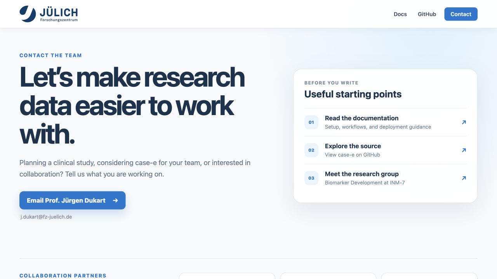

Contact, support, attribution, and legal notice
===============================================

Hosted case-e
-------------

The hosted case-e application is available at
`https://ecrf.inm7.de/login <https://ecrf.inm7.de/login>`_. Access can require
an approved account and study-specific authorization.

For a local evaluation without a hosted account, follow :doc:`getting-started`.
For an organization-managed deployment, follow :doc:`deployment` and complete
the required security and validation review.

Contact and collaboration
-------------------------

For scientific collaboration, institutional use, hosted-access questions, or
interest in applying case-e to a research study, contact:

**Prof. Jürgen Dukart**
   Biomarker Development Group, INM-7, Forschungszentrum Jülich

   Email: `j.dukart@fz-juelich.de <mailto:j.dukart@fz-juelich.de?subject=case-e%20collaboration>`_

   Research group: `Biomarker Development at INM-7
   <https://www.fz-juelich.de/en/inm/inm-7/research-groups/biomarker-development>`_

   The public case-e contact page links directly to Prof. Jürgen Dukart and the
   Biomarker Development research group.

When contacting the team, describe the intended study, expected number of
users/subjects, deployment preference, data sensitivity, required integrations,
and desired collaboration. Do not email participant data, credentials, active
shared links, password-reset tokens, or secret configuration files.

Support channels
----------------

Documentation questions
   Open an issue in the
   `case-e documentation repository <https://github.com/venkateshhs/case-e-docs/issues>`_
   or contact the documentation maintainer listed below.

Application bugs and feature requests
   Use the
   `case-e application issue tracker <https://github.com/Biomarker-Development-at-INM7/eCRF/issues>`_.
   Include the application version/build, deployment type, sanitized steps, and
   exact error message. Never submit clinical data or secrets to a public issue.

Hosted access and collaboration
   Contact Prof. Jürgen Dukart using the address above. Account approval and
   study access are separate from general software support.

Security, privacy, or production incidents
   Contact the responsible deployment administrator through the organization's
   approved incident channel. Do not disclose a vulnerability, participant
   information, or production credentials in a public issue.

Authorship and maintenance
--------------------------

**Documentation author and maintainer:**
`Venkatesh Hariharapura Shivashankar <https://github.com/venkateshhs>`_

The named maintainer curates, reviews, publishes, and updates the documentation
repository. Project software can also include contributions from other case-e
contributors; consult the application and documentation Git histories for the
corresponding change records.

.. _ai-generation-disclosure:

AI-generation disclosure and legal notice
-----------------------------------------

**This documentation site—including its organization, explanatory prose, and
workflow descriptions—was generated entirely by ChatGPT.** This disclosure is
made expressly for transparency and legal attribution.

ChatGPT and OpenAI are not the author, maintainer, publisher, operator, sponsor,
or legal guarantor of case-e. AI-generated material can contain omissions,
ambiguities, or errors. The named human maintainer remains responsible for
reviewing, accepting, publishing, correcting, and versioning the documentation.

This documentation is informational software guidance. It is not legal,
medical, clinical, regulatory, information-security, or compliance advice and
does not establish that case-e or a particular deployment satisfies GCP, GDPR,
HIPAA, 21 CFR Part 11, or any other standard. Users and deploying organizations
must independently validate the installed software and obtain appropriate
professional advice for their intended use, jurisdiction, protocol, and data.

If this documentation conflicts with the validated behavior of the installed
case-e release, stop the affected workflow, preserve relevant evidence, and ask
the maintainer or deployment administrator to reconcile the difference before
continuing regulated or production activity.
